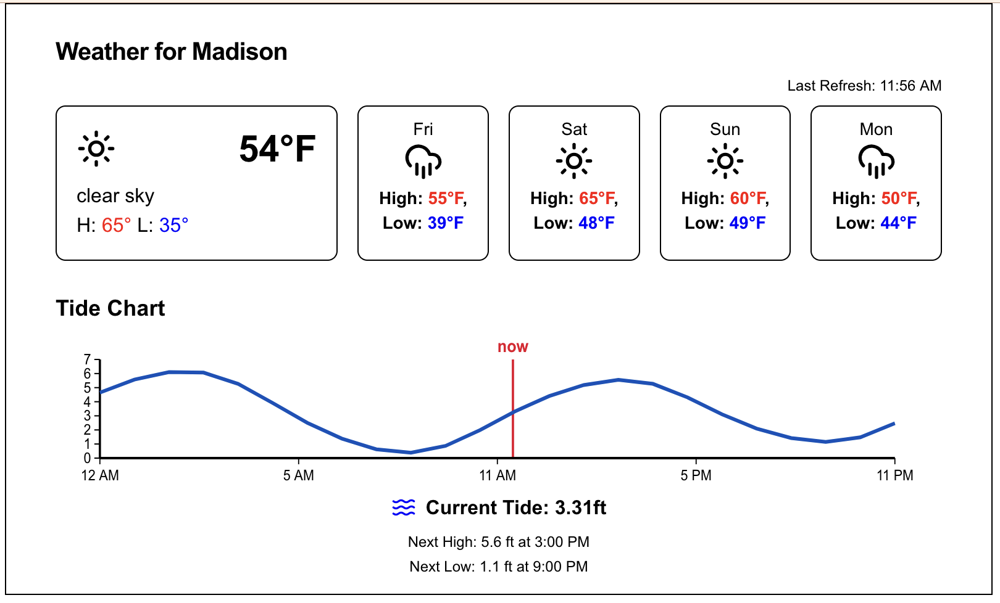

# Weather App

A modern weather application built with Next.js that displays weather conditions and tide predictions.

I'm using this with a [Primoroni Inky 7 Display](https://shop.pimoroni.com/products/inky-impression-7-3?variant=55186435244411)




## Features

- Real-time weather information
- Tide height predictions with interactive charts
- **Screenshot API** - Generate PNG images of the weather display for e-ink displays and ESP32 modules
- Dynamic weather icons based on conditions:
  - Clear sky
  - Few clouds
  - Scattered clouds
  - Broken clouds
  - Shower rain
  - Rain
  - Thunderstorm
  - Snow
  - Mist
- Responsive design with Tailwind CSS

## Tech Stack

- [Next.js](https://nextjs.org/) - React framework
- [TypeScript](https://www.typescriptlang.org/) - Type safety
- [Tailwind CSS](https://tailwindcss.com/) - Styling
- [Lucide React](https://lucide.dev/) - Icons

## Getting Started

1. Clone the repository:
   ```bash
   git clone <repository-url>
   ```

2. Install dependencies:
   ```bash
   npm install
   # or
   yarn install
   ```

3. Create a `.env.local` file with your API keys:
   ```env
   # Get an OpenWeatherMap API Key: https://openweathermap.org/
   OPENWEATHERMAP_API_KEY=<API_KEY>
   # Must be (<CITY>,<STATECODE>,<COUNTRYCODE>) supported by Openweathermap Geocoding API: https://openweathermap.org/api/geocoding-api
   WEATHERAPP_CITY='Madison,CT,USA' 
   # Find tide station at https://tidesandcurrents.noaa.gov/
   WEATHERAPP_TIDE_STATION_ID=8465705
   ```

4. Run the development server:
   ```bash
   npm run dev
   # or
   yarn dev
   ```

5. Open [http://localhost:3000](http://localhost:3000) in your browser.

## API Endpoints

### Screenshot API

Generate PNG screenshots of the weather display for use with e-ink displays, ESP32 modules, or other embedded devices.

**Endpoint:** `GET /api/screenshot`

**Query Parameters:**
- `width` (optional): Image width in pixels (default: 800)
- `height` (optional): Image height in pixels (default: 480)

**Example Usage:**
```bash
# Get a screenshot sized for a 7" e-ink display
curl "http://localhost:3000/api/screenshot?width=800&height=480" -o weather.png

# Get a screenshot for a smaller display
curl "http://localhost:3000/api/screenshot?width=400&height=300" -o weather.png
```

**ESP32 Example:**
```cpp
// ESP32 code to fetch and display weather image
#include <HTTPClient.h>
#include <WiFi.h>

HTTPClient http;
http.begin("http://your-server.com/api/screenshot?width=800&height=480");
int httpCode = http.GET();
if (httpCode == 200) {
  // Process the PNG data for your e-ink display
  WiFiClient* stream = http.getStreamPtr();
  // ... display implementation
}
```